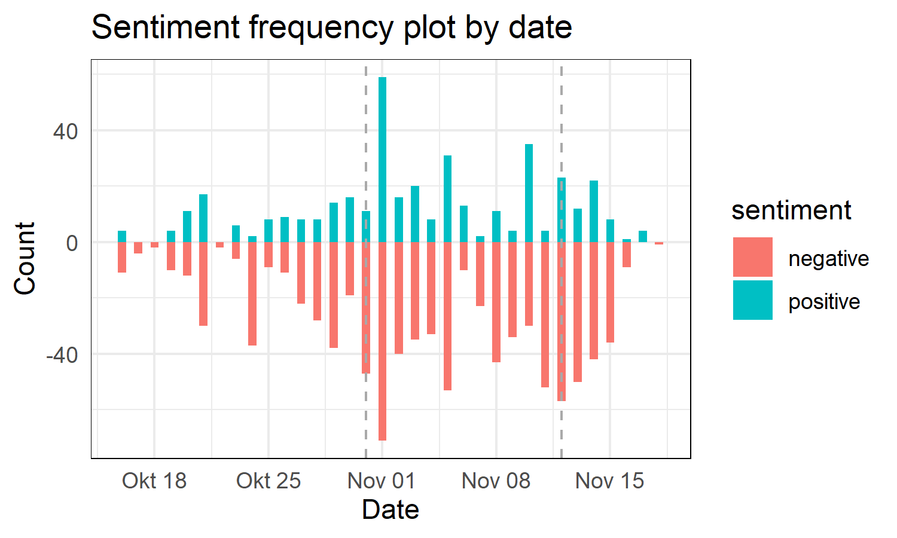
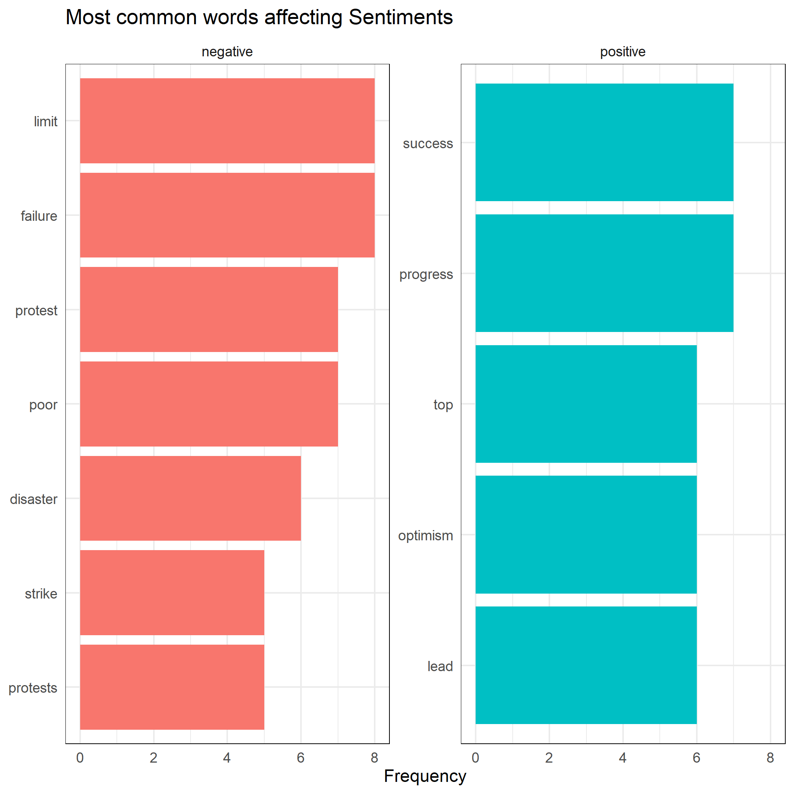

```{r setup, include=FALSE}
knitr::opts_chunk$set(echo = TRUE, message = FALSE, warning = FALSE)
```

## Quantitative Text Analysis of 'The Guardian' headlines

The following analysis presents a quantitative text analysis of "The Guardian" newspaper's headlines in the period going from 18 October 2021 and 28 November 2021 to apply a sentiment analysis around the negotiations of COP26 that took place in Glasgow from October 31st and November 12th. 


### Statement of contributions 
 - Laura
 - Kat
 - Nassim


### Introduction 
The 26th Conference of the Parties that took place in Glasgow has represented a crucial moment for climate policy negotiations. 
The majority of the most influential international leaders attended the event to discuss on future global action regarding climate mitigation and adaptation, together with non-state actors and internationally renowned personalities. Such occasion gained substantial media attention from all over the world, with peaks in the intervals right before the starting of the COP (the so-called 'PreCOP' events), during the actual happening of the Conference, and right after the conclusion of such event. 
However, media outlets would approach climate change in different ways that reflect their political positioning: the headlines, the highlights as well as the frequently mentioned topics would differ based on political position. 
We collect data from the headlines of a British newspaper to analyse possible trends and changes in sentiment along the specific timeframe that goes from the weeks right before the Conference until the period right after it. 

### Motivation
As public policy students concerned about climate negotiations, we are interested in investigating the different opinions and attitudes expressed by media outlets in the above-mentioned periods of time. We are mainly concerned on whether the standpoint and the perspective of media outlets changed over time, and how the trends of this change would be developed. 
To accomplish that, we decided to analyse the sentiment of just one media outlet published in the COP26 host country, namely The Guardian. Moreover, this newspaper is considered as a left-leaning, according to [YouGov](https://yougov.co.uk/topics/politics/articles-reports/2017/03/07/how-left-or-right-wing-are-uks-newspapers) findings. Topics as climate financing for instance were a crucial topic on the table of COP26 negotiations, hence choosing a non-neutral outlet - which would have endorsed such topic - can show more compelling results in terms of changes in the political positioning with respect to the outcomes, that will eventually be reflected in the headlines. 
 

### Research question
The principal objective of this research aims at analysing trends in the attitude of the newspaper headlines with respect to COP26 topics. Then, the other questions related to this analysis are related to two macro areas. 
The first one tackles the original and main interest, that is whether the ratio of positive and negative words changes over time, and in which period this eventually happens. Questions related to this area are: 

 - Are the words used in the headlines of 'The Guardian' providing a specific sentiment? 
 - What is the ratio of positive over negative words in the collected data? Does this ratio changes over time? 
 - Overall, is this sentiment more positive or negative? Which are the most positive and negative words? 
 - Are there any possible interesting patterns among the most frequent words that could be inspected further? 

The second area concerns a more specific analysis that also takes into account how such results could change when using different measurement instruments, in this case, dictionaries. Questions related to this area are: 

 - Is the sentiment analysis consistent across different dictionaries?
 - Do any differences and/or overlaps induce any political interpretation? Are the results relevant for political interpretation? 

### Methods

- USING BOTH TIDYTEXT AND QUANTEDA --> 2 diff methods but we chose to use both to work better with dates and to do a comprehensive usage of tools

### Limitations 
Being a newspaper of the host country of the climate negotiations, The Guardian would not represent an ideal sample of headlines that would allow us to deduce if COP26 has met the expectations or not through the sentiment analysis. Indeed, the results would only show the changes in opinions for the specific political leaning that such outlet represents. However, the values of this project are to apply procedures of sentiment analysis after scraping information from the web and present them to the user in an accessible format. Therefore, it is necessary to acknowledge the very limited scope of this analysis. 
Another present limitation regards the dates that have been scraped from The Guardian website. Given the used web-scraping strategy, the most recent dates present some missing values caused by an heterogeneous format in the website pages. For demonstration purposes we simply dropped those missing values. 

## Retrieving the data
The webscraping, cleaning and formatting section of the analysis can be found in the R script *scraping_and_data_cleaning* that is available in the repository. 
The webscraping strategy adopted consists in downloading the headlines from multiple pages of the newspaper website by  date (static webscraping). 
The formatting step includes transformation of dates into the correct format with lubridate and and data preparation for the quantitative text analysis with tidytext. 
In this part, words regarding the main topic of the headlines ("cop26", "glasgow","climate","change") were expected to be very frequent, other than not contributing to a specific senitment, so they have been removed as stopwords. 

## Explorative analysis 

Through the exploration of the collected data, we aim at understanding which are the most frequent words and whether they could have a role in our investigation. 

Thanks to a frequency table and an explorative WordCloud, we visualize the most frequent words. We identify 'crisis' as the most frequent word (other than the customized stopwords) used in the headlines during the COP26 period. 

Thanks to the keyword in context table, it is explored quickly whether any case in which the word 'crisis' has a role different from being part of the 'climate crisis' bigram is present. It is not found to be the case. Since the main topic of COP26 is exactly that of 'tackling the climate crisis', this word, despite clearly indicating a negative sentiment, does not represent relevant information. It is therefore dropped.  

### WordCloud

Comment on wordcloud
```{r, fig.align='center', echo= FALSE, fig.show='hold', out.width= '75%'}

knitr::include_graphics("wordcloud.png")
```
To see better: 


### Keywords in context for the most frequent word

## Sentiment analysis 

### Sentiment frequency





### Bing et al. visualization


### LSD2015 visualization

### Exploration of interesting patterns

#### Boris Johnson stuff

## Concluding remarks

## Further research suggestions


